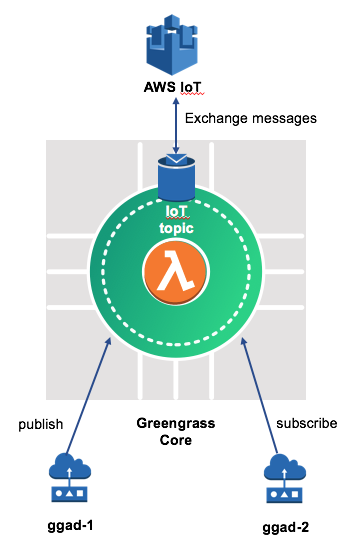

# Greengrass Workshop - Basic

This Bootcamp will provide an understanding of the basics of AWS Greengrass. The guideline was written to be used on an **Amazon EC2 Instance**. But it should be easy to replace the code to be used with your own device (ex. RaspberyPI)

During this workshop you will learn how to connect devices to AWS IoT and Greengrass, install Greengrass and device communication via Greengrass

## Prerequisites
To conduct the bootcamp you will need the following tools/setup/knowledge:

* AWS Account
* Laptop
* Secure shell (ssh) to login into your Greengrass Core (EC2/RPi) and secure copy (scp) to copy files
	* Mac OS/Linux: command lines tools are installed by default
	* Windows
		* Putty: ssh client: <http://www.putty.org/>
		* Manual connect (ssh) to an EC2 instance from Windows with Putty: <http://docs.aws.amazon.com/AWSEC2/latest/UserGuide/putty.html>
		* WinSCP: scp client for Windows: <https://winscp.net/eng/index.php>

* You need to have an ssh key-pair to be able to log into the instance
	* Instruction on how to create one is listed below 

* **Refer to [Appendix](#Appendix) on how to connect to EC2 instance, how to secure copy file, etc.**

##You will build this architecture:

## Login and Choose AWS Region

AWS Console Login and Region Selection

	Go to AWS Console: https://console.aws.amazon.com/console/
	Login as IAM user which have enough privilege
	Choose AWS region (right top): Tokyo 
	

## Amazon EC2 Instance

### Create EC2 Key Pair
You can skip below steps if you already have existing EC2 Key Pair in the region.

	From the AWS Management Console, choose Services, then select EC2 under Compute.
	Click Create Key Pair
	Specify Key Pair Name, click Create
	Save the .pem file to your local folder

### Launch Amazon EC2 Instance
To launch an EC2 instance manually execute the following steps in the AWS Console:

	EC2
	Launch Instance
	Step 1: Choose an Amazon Machine Image (AMI) -> Amazon Linux AMI (first one)
	Select
	Choose t2.micro
	Next: Configure Instance Details
	Next: Add Storage
	Next: Add Tags
	Click "Add Tag"-> Key: Name, Value: Greengrass Workshop
	Next: Configure Security Group
	Add Rule: 
	Type: Custom TCP Rule, Protocol: TCP, Port Range: 8883, Source: Custom 0.0.0.0/0, Description: MQTT over TLS
	Review and Launch
	Launch
	Choose an existing key pair
	Check "I acknowledge that I have access to the selected private key file"
	Launch Instances

Go to EC2 console, wait until instance state is "running"

Take note of EC2 Instance Public IP

### SSH to Amazon EC2 Instance and Execute Command

SSH into the instance: refer to [Appendix](#Appendix)

Then execute this command

		sudo yum -y install git

---


## Provision GGAD-1

### Connect Thing to AWS IoT
### What you will learn:
Connecting a device to AWS IoT, a Greengrass Core to AWS IoT or a Greengrass Aware Device (GGAD) to a core works in the same way by using X.509 certificates and connectivity information. At first you will learn how to connect a device to AWS IoT.

You will do a quickstart to provision a thing through the AWS IoT console. A zip file will be provided containing keys and certificates and a script to install further required software.

Go to the AWS console
		
	1. From the AWS Management Console, choose Services, type IoT Core, then select
	2. Get started (only if no resources are provisioned) 
	3. Onboard
	2. Configuring a device -> Get started
	3. Connect to AWS IoT -> Get started 
	4. Choose Linux/OSX and Python -> Next
	5. Register a thing Name "ggad-1" -> Next step
	6. Download a connection kit -> Linux/OSX -> A file "connect_device_package.zip" will be download. Proceed to the next step after download is finished.
	7. Next step
	8. Done
	9. Done
	
SSH into the EC2 instance:

	1. In user home folder (/home/ec2-user)
	2. Create a directory named "ggad-1"
	3. Copy (scp) "connect_device_package.zip" into the directory "ggad-1"
	   For manual on SCP, refer to Appendix section
	4. Unzip the file "connect_device_package.zip"
	   command: unzip connect_device_package.zip

	
You should see the following directory contents:

	$ ls
	connect_device_package.zip  ggad-1.private.key  start.sh
	ggad-1.cert.pem             ggad-1.public.key

Launch client program:

	chmod +x start.sh
	sudo ./start.sh

Verify Message Sent to AWS IoT Core

	Go to AWS IoT Core console
	From left pane navigation, click "Test"
	In Subscription Topic, type: sdk/test/Python
	Click "Subscribe to Topic"
	You will see the message arrive at AWS IoT
	Stop the script

By seeing messages arriving in the AWS IoT console you have successfully sent data from a device to AWS IoT.

Sometimes when launching the script **start.sh** errors are encountered:

* start.sh does not start: On some systems an explicit shebang line is needed. So add a first line "#!/bin/bash" or "#!/bin/sh" to start.sh
* start.sh installs the AWS IoT Python SDK in the local directory. This can result in "error: could not delete... : Permission denied" error. The reason for that is that the installation procedure tries to delete files in global directories. Simply fire up start.sh again or try to launch start.sh as root.
	
	
## Send GGAD-1 sensor data to AWS IoT
### What you will learn:
You will send sensor data in JSON format to AWS IoT and watch the incoming data in the MQTT client which is built in to the AWS IoT console.

Download following scripts and copy them the the directory **ggad-1** which you have created earlier:

* [GGBootcampPubSub.py](GGBootcampPubSub.py)
* [gg\_discovery\_api.py](gg_discovery_api.py)

The script **start.sh** in the directory **ggad-1** must be modified to call **GGBootcampPubSub.py** instead of the example script from the AWS IoT Python SDK:
	
	Edit "start.sh" 
	
	Replace "aws-iot-device-sdk-python/samples/basicPubSub/basicPubSub.py"
	with
	"GGBootcampPubSub.py"
	
The resulting line in "start.sh" should look like:

	python GGBootcampPubSub.py -e <YOUR_ENDPOINT>.<AWS_REGION>.amazonaws.com -r root-CA.crt -c ggad-1.cert.pem -k ggad-1.private.key
	

Subscribe to the MQTT client built in to the AWS IoT console to see the messages which will be sent later on

	Go to AWS IoT Core console
	From left pane navigation, click "Test"
	In Subscription Topic, type: sdk/test/Python
	Click "Subscribe to Topic"
	Do the same with topic: $aws/events/#
	
Now it is time to send sensor data to AWS IoT. On your device:
	
	sudo ./start.sh

At the AWS IoT console

	Watch the subscription result in the AWS IoT console

On your device

	Stop the script "start.sh"
	
## Provision GGAD-2

Provision a second device **ggad-2** the same way that you did for the device ggad-1. It will be in the same EC2 instance but different folder ***!!! Name it ggad-2 not again ggad-1 !!!***

---

## Change Client Id of GGAD-1 and GGAD-2

A MQTT client uses a clientId when connecting to AWS IoT and the clientId must be unique. 

By default the scripts are connecting with the clientId "basicPubSub". To make the clientId unique we want them to connect as "ggad-1" and "ggad-2". 

**Change the clientId for "ggad-1" on your device**

Line after modification similar to this one:

	python GGBootcampPubSub.py -e <YOUR_ENDPOINT>.<AWS_REGION>.amazonaws.com -r root-CA.crt -c ggad-1.cert.pem -k ggad-1.private.key --clientId ggad-1

**Change the clientId for "ggad-2" on your device**

Line after modification similar to this one:

	python GGBootcampPubSub.py -e <YOUR_ENDPOINT>.<AWS_REGION>.amazonaws.com -r root-CA.crt -c ggad-1.cert.pem -k ggad-1.private.key --clientId ggad-2
		
To test if the clientId setting works go to the AWS IoT console an subscribe to 

	$aws/events/#

Start the script and check in the AWS IoT console if it connects with the modified clientId.

At this time, two device (ggad-1 and ggad-2) is connected to AWS IoT and sending their sensor data.

Stop the script

---

## Provision a Greengrass Group

#### Create a Greengrass group

	1. Go to AWS IoT Core console -> Greengrass
	2. Groups
	3. Create Group
	4. Use easy creation
	5. Group Name: myFirstGGG
	6. Next
	7. Leave Name for Core untouched
	8. Next
	9. Create Group and Core
	10. Download these resources as a tar.gz with file name: <randomname>-setup.tar.gz
	11. Download Greengrass software (x86_64 / Amazon Linux) with file name: greengrass-<platform>-<version>.tar.gz
	12. Finish !!! Don't forget to click "Finish". Otherwise your group will not be created !!!
	
Verify in the AWS IoT console that your Greengrass Group has been created

	Greengrass -> Groups

## Install Greengrass on your device

You will install Greengrass Core inside your EC2 instance.

EC2 which will act as your Greengrass Core the Greengrass software needs to be installed.

On your device:

1. Copy (scp) file **greengrass-\<platform\>-\<version\>.tar.gz** to EC2 directory /tmp

2. SSH to EC2

3. Extract the Greengrass software to the root directory:

		sudo tar -zxvf greengrass-<platform>-<version>.tar.gz -C /

4. To run the Greengrass software your device needs to be prepared:
	* Copy (scp) [gg-prep-ec2.sh](gg-prep-ec2.sh) onto EC2 and run it as "root" **on your EC2 instance**
		
			chmod +x gg-prep-ec2.sh 
			sudo ./gg-prep-ec2.sh   	
   * reboot if required
   * **When the script finished without errors [skip to step 7](#step7)**
   
5. If Linux control groups (cgroups) are not enabled on the operating system of your AWS Greengrass core device, download and run the following script: <https://raw.githubusercontent.com/tianon/cgroupfs-mount/master/cgroupfs-mount>

	The script will also check if cgroups are enabled on your system.
	
6. To automatically configure the Lambda cgroup, add 

		cgroup /sys/fs/cgroup cgroup defaults 0 0
		
	to the **/etc/fstab** file on your device, and then reboot your device.

7. Copy (scp) the tar.gz file that you have downloaded during the Greengrass group creation to your device into the directory /tmp. The tar.gz file's name is similar to <unique-string>-setup.tar.gz

	The tar.gz file contains keys, certificate and a configuration file (config.json) which will be used to configure your Greengrass Core.

8. SSH into your device and unpack the tar.gz which you have copied to your instance earlier into the directory **/greengrass**

		sudo tar -zxvf /tmp/<unique-string>-setup.tar.gz -C /greengrass/
		
	Now you are ready to start your Greengrass core. 

**But** before you start the Greengrass daemon subscribe to the following topics. If the Core starts correctly you can observe activities on that topics.

Go to the AWS IoT console

	1. Test
	2. Subscribe $aws/events/#

Now fire up Greengrass on your device:

* SSH into your device:

		cd /greengrass/ggc/core
		sudo ./greengrassd start
	
See Subscription Topic in AWS IoT console for output. 

You need to become **root** to access the log-directories on the Greengrass Core:

	sudo su -

On the device, see Greengrass system component log:

	cd /greengrass/ggc/var/log/system/
	tail -f runtime.log
		

If there are any problems when starting AWS Greengrass check file "crash.log" for errors: 

	/greengrass/ggc/var/log/crash.log
	
Your AWS Greengrass Core should be up and running.

---

## Add devices to the Greengrass Group
The Greengrass Group consists currently only of a Core. In this step you will add devices to the Group. You will use the devices "ggad-1" and "ggad-2" which you used before. But these device will later be configured to connect to your Core instead of AWS IoT.

Go to the Greengrass console

	1. Groups
	2. myFirstGGG
	3. Devices
	4. Add your first Device
	5. Select an IoT Thing
	6. Select ggad-1 -> Finish
	7. Add ggad-2 in the same way to your Greengrass Group
	

## Create a subscription
The two devices ggad-1 and ggad-2 which you just added to the Greengrass Group should communicate where **ggad-1 acts as a publisher and ggad-2 as a subscriber.**

To route messages between devices and therefore allow communication a so called **subscription** must be defined.

A subscription is a routing rule which consists of a source, a target an a topic filter. A subscription defines which source may communicate to which target on which topic. 

Go to the Greengrass console

	1. Groups
	2. myFirstGGG
	3. Subscriptions
	4. Add your first Subscription
	5. Select a source -> Devices -> ggad-1
	   Select a target -> Devices -> ggad-2
	   Next
	6. Optional topic filter -> sdk/test/Python
	   Next
	7. Finish
	
We have now created devices and subscriptions in the Greengrass Group and are ready for the first deployment. But before deploying for the first time let's enable logging for Greengrass.

## Enable Logging for Greengrass

By default logging is not enabled for the Greengrass Core. Logging should be enabled to get insights what happens on the Core and also for troubleshooting purposes.

Go to the Greengrass console

	1. Groups
	2. myFirstGGG
	3. Settings
	4. Scroll down
	   Local logs configuration -> Edit
	5. Add another log type
	6. Check both "User Lambdas" and "Greengrass system"
	   Update
	7. What level of logs should be sent? -> Select Debug logs
	7. Save

Logfiles on the Greengrass Core:

	Log directory: /greengrass/ggc/var/log
	System logs: /greengrass/ggc/var/log/system
	Lambda logs: /greengrass/ggc/var/log/user/<AWS_REGION>/<ACCOUNT_ID>
				

## Deploy the Greengrass Group to the device
After a Greengrass Group was created or changed the configuration needs to be deployed to the Greengrass Core.

On the device:

	cd /greengrass/ggc/var/log/system
	tail -f localwatch/localwatch.log *.log
	
In the AWS Greengrass Console

	1. Groups
	2. myFirstGGG
	3. Actions -> Deploy
	4. Choose Automatic detection

If this is your first time deploy Greengrass, console will prompt message whether you allow "Grant permisssion to access other services" so that Greengrass can works with other services like AWS IoT and AWS Lambda.
Click **Grant Permission**

	
After some moments you should see activity in the logs on the device and the deployment status at the console.

You can see the status from Console (Deployment) showing "Successfully Completed"

## Connect devices to the Greengrass Core
Now that the Greengrass core got a configuration set through a deployment devices will be connected to the Greengrass Core.

To connect devices to a Greengrass Core the connectivity information - ip address/DNS name and port - is required as well as the CA certificate which signed the Core's certificate. 

These settings can be obtained automatically by devices through the discovery service in AWS IoT. To use the discovery service an IoT policy is required which allows the action **greengrass:Discover**. 

To connect the devices ggad-1 and ggad-2 to the core by using the connectivity information from the discovery service the action **greengrass:Discover** must be added to the policy of each device.

Go to the AWS IoT console

	1. Manage
	2. Things
	2. Choose ggad-1
	3. Security
	4. Click the certificate
	5. Policies
	6. Click ggad-1-Policy
	7. Edit policy document
	8. in the Action section add "greengrass:Discover" -> Save as new version
	
Your new policy document should look like the following:

	{
	  "Version": "2012-10-17",
	  "Statement": [
	    {
	      "Effect": "Allow",
	      "Action": [
	        "iot:Publish",
	        "iot:Subscribe",
	        "iot:Connect",
	        "iot:Receive",
	        "greengrass:Discover"
	      ],
	      "Resource": [
	        "*"
	      ]
	    }
	  ]
	}

#### Change the policy document also for the device **"ggad-2"**

The Greengrass Core can have multiple Core endpoints that means connection information. The script that you will use to connect to the GG Core will iterate through the connections advertised by the core and will use the first successful connection.

Take a look at the available Core endpoints:

	1. Go to the AWS Greengrass Console
	2. Cores
	2. myFirstGGG_Core
	3. Connectivity

## Device to device communication
The devices ggad-1 and ggad-2 will connect to the Greengrass Core and communicate locally.
ggad-1 will act as publisher and ggad-2 as a subscriber which will write the data received from ggad-1 to STDOUT.

By default the devices are connecting to AWS IoT. To point them to a Greengrass Core the command line parameter "--connect-to greengrass" is used.

Modify for **both** devices the script **"start.sh"** and add **"--connect-to greengrass"** to the line which starts the Python script GGBootcampPubSub.py. 

The resulting line of **"start.sh"** should look like (for **ggad-1**):

	python GGBootcampPubSub.py -e <YOUR_ENDPOINT>.<AWS_REGION>.amazonaws.com -r root-CA.crt -c ggad-1.cert.pem -k ggad-1.private.key --clientId ggad-1 --connect-to greengrass

The resulting line of **"start.sh"** should look like (for **ggad-2**):

	python GGBootcampPubSub.py -e <YOUR_ENDPOINT>.<AWS_REGION>.amazonaws.com -r root-CA.crt -c ggad-1.cert.pem -k ggad-1.private.key --clientId ggad-2 --connect-to greengrass

Open two terminals and start the devices with the script start.sh:

	Terminal 1: start ggad-2
	Terminal 2: start ggad-1
	Terminal 1: you should see messages arriving from ggad-1 to ggad-2

In the file "router.log" Greengrass logs the routing of messages. This log can be found in the following directory:
	
	/greengrass/ggc/var/log/system/router.log

Stop both script

---

## Device to cloud communication
In this exercise messages will be send from a device (ggad-2) to the cloud. To route the messages accordingly from a device to the cloud another subscription has to be created.

Go to the Greengrass console

	Groups
	myFirstGGG
	Subscriptions
	Source: Device ggad-2
	Target: IoT Cloud
	Next
	Optional topic filter: sdk/test/Python
	Finish

Deploy changes

	Groups
	myFirstGGG
	Actions -> Deploy
		
Go to the AWS IoT console

	Subscribe in AWS IoT to the topic sdk/test/Python
	
On your device
	
	Start ggad-2
	
Look for incoming messages in the AWS IoT MQTT client

Stop script

---	

## Cloud to device communication
It is also possible to send messages from the **cloud to a GGAD**. 

In this exercise data from the **cloud should be routed to the device ggad-1**. 

As you may guess another subscription and deployment is needed.

Create a subscription in your Greengrass Group with:

	Groups
	myFirstGGG
	Subscriptions	
	Source: IoT Cloud
	Target: Device ggad-1
	Optional topic filter: sdk/test/Python
	Finish

Deploy changes

	Groups
	myFirstGGG
	Actions -> Deploy
	
On your device
	
	Start ggad-1
	
Go to the AWS IoT MQTT client and publish a message
	
	AWS IoT Console
	click "Test"
	Publish to a topic
	Topic: sdk/test/Python
	You can leave the default message untouched
	Click "Publish to topic"

On your device in the window/terminal where ggad-1 is running look for incoming messages.

Stop the script

---

## Deploy a Lambda Function

This is the start to learn how to deploy a Lambda function on AWS Greengrass.

When you deploy this Lambda function to the Greengrass core as a long-lived lambda function it will send every 5 seconds a message to the topic `hello/world`. You can easily see the messages in the AWS IoT console.

Create Lambda Function

	1. Go to AWS Console -> Services -> Lambda
	2. Create Function
	3. Choose Blueprints
	4. In Blueprints filter type: greengrass
	5. Enter
	6. Choose "greengrass-hello-world"
	7. Name: Greengrass_HelloWorld
	8. Role - choose Create new role from templates(s). 
	9. Role name: GreengrassLambdaRole
	10. Create Function
	11. Publish New Version
		* Actions menu -> Publish new version
		* Version description: 1
		* Publish
	12. Create Lambda Alias
		* Actions menu -> Create alias
		* Name: GG_HelloWorld
		* Version: 1
		* Create

Add Lambda to Greengrass

	1. Go to Greengrass Console
	2. Greengrass -> Groups -> myFirstGGG
	3. Lambdas
	4. Add your first lambda
	5. Use existing lambda
	6. Choose: Greengrass_HelloWorld
	7. Alias: GG_HelloWorld
	8. Finish
	9. Choose the ellipsis (…) for the Lambda function, then choose Edit Configuration
	10. Timeout: 25second
	11. Lambda lifecycle: 'Make this function long-lived and keep it running indefinitely'
	12. Update

Add Subscriptions

	1. Greengrass -> Groups -> myFirstGGG
	2. Subscription
	3. Add Subcscription
	4. Source: Lambdas -> Greengrass_HelloWorld
	5. Target: IoT Cloud
	6. Next
	7. Optional topic filter: hello/world
	8. Next
	9. Finish

Deploy changes

	Groups
	myFirstGGG
	Actions -> Deploy
	
See the result

	Go in the AWS IoT Console in the test tab and subscribe to the topic `hello/world`

---

## Local Device Invoke Local Lambda Function

You will learn how local device invoke local lambda function 

Scenario will be: ggad-1 -> lambda -> AWS IoT
where lambda will receive the JSON payload from ggad-1, add counter, and send it to AWS IoT

**Go to Lambda Console and replace Greengrass_HelloWorld function as follow then Save**
	
	import greengrasssdk
	import json

	# Counter to keep track of invocations of the function_handler
	my_counter = 0

	# Creating a greengrass core sdk client
	client = greengrasssdk.client('iot-data')

	def function_handler(event, context):
		global my_counter
    	my_counter = my_counter + 1
	  	event['my_counter'] = my_counter
    	client.publish(topic='hello/world',payload=json.dumps(event))
    	return

**Publish New Version**
	
	Lambda Console
	Actions menu -> Publish new version
	Version description: 2
	Publish

**Change Lambda Alias to point to new version**
	
	Lambda Console
	Version menu
	Aliases tab
	GG_HelloWorld
	Scroll down until you find Version and change it to: 2
	Save
	
**Add subscription**

	1. Greengrass -> Groups -> myFirstGGG
	2. Subscription
	3. Add Subcscription
	4. Source: Devices -> ggad-1
	5. Target: Lambdas -> Greengrass_HelloWorld
	6. Next
	7. Optional topic filter: sdk/test/Python
	8. Next
	9. Finish	
	
**Deploy changes**

	Groups
	myFirstGGG
	Actions -> Deploy
	
**Execute Client Script (ggad-1)**
	
	SSH to EC2 Instance in another terminal
	cd /home/ec2-user/ggad-1
	sudo ./start.sh

**View Lambda Log**
	
	SSH to EC2 Instance
	sudo su -
	cd /greengrass/ggc/var/log/user/<region>/<aws-account>
	tail -f Greengrass_HelloWorld.log

**See Message sent to AWS IoT**

	Go in the AWS IoT Console in the test tab and subscribe to the topic `hello/world`

Notice that in the JSON payload, there is **my_counter** attribute, which is added by local lambda.

## Cleanup

List to be cleanup
	
	Terminate EC2 Instance
	Delete Greengrass Group (You need to reset deployment first for the greengrass group) 
	Delete IoT Thing (GG Core, ggad-1, ggad-2)
	Delete Lambda function
	

[[Top](#Top)]
  
## Appendix

### Connecting to Linux Instance from Windows Using PuTTY

This section is for **Windows** users only. 

Make sure that you've already install [PuTTY](https://www.chiark.greenend.org.uk/~sgtatham/putty/latest.html)

Converting Your Private Key Using PuTTYgen
	
	Start PuTTYgen (for example, from the Start menu, choose All Programs > PuTTY > PuTTYgen).
	Under Type of key to generate, choose RSA. 
	If you're using an older version of PuTTYgen, choose SSH-2 RSA. 
	Choose Load. By default, PuTTYgen displays only files with the extension .ppk. To locate your .pem file, select the option to display files of all types. 
	Select your .pem file for the key pair that you specified when you launched your instance, and then choose Open. Choose OK to dismiss the confirmation dialog box.
	Choose Save private key to save the key in the format that PuTTY can use. PuTTYgen displays a warning about saving the key without a passphrase. Choose Yes. 
	Specify the same name for the key that you used for the key pair (for example, my-key-pair). PuTTY automatically adds the .ppk file extension.

Connect to EC2 Instance
	
	Launch PuTTY
	Host Name: enter Public IP of EC2 instance
	Connection list -> SSH
	Auth
	Private key file for authentication
	brows .ppk (your private key that have been downloaded before)
	PuTTY Security Alert -> Yes -> Add to PuTTY's cache
	login as: ec2-user
	Enter
	
	
### Connecting to Linux Instance from MacOs / Linux

	chmod 400 <path and name pem>
	ssh -i <path and name pem> ec2-user@<Public IP>

\<path and name pem\>, substitute the path / filename that you downloaded

\<Public IP\>, substitute to EC2 Public IP address

### Transfer File (SCP) from MacOS / Linux

	scp -i <path-to-your-private-key> <path-to-connect_device_package.zip> ec2-user@<your-ec2-public-ip>:<remote-target-folder>
   	
### References

[Connecting to Your Linux Instance from Windows Using PuTTY / SCP / WinSCP](https://docs.aws.amazon.com/AWSEC2/latest/UserGuide/putty.html)
	
	Connecting to Your Linux Instance from Windows Using PuTTY
	Transferring Files to Your Linux Instance Using the PuTTY Secure Copy Client 
	Transferring Files to Your Linux Instance Using WinSCP 
	
[Connecting to Your Linux Instance Using SSH (MacOs / Linux) / SCP](https://docs.aws.amazon.com/AWSEC2/latest/UserGuide/AccessingInstancesLinux.html)
	
	Connecting to Your Linux Instance Using SSH 
	Transferring Files to Linux Instances from Linux Using SCP 
